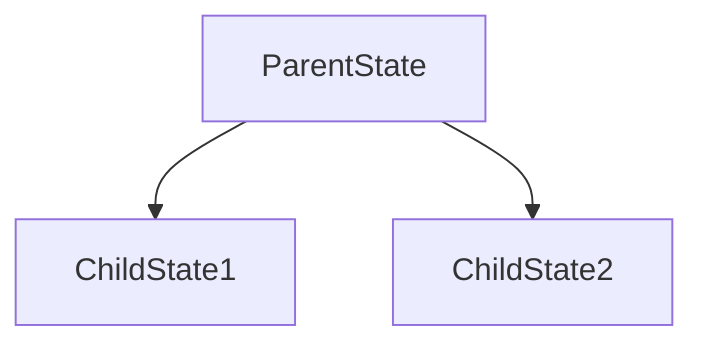
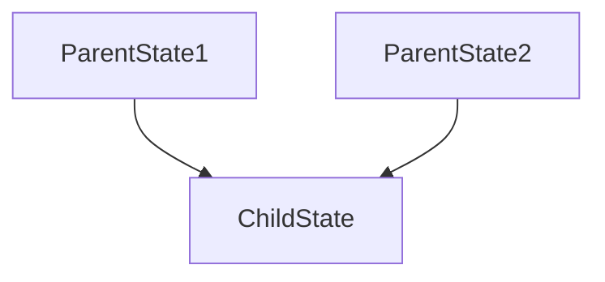

## Scope란?
- Scope는 큰 상태(Parent)에서 작은 상태(Child)로 데이터를 전달하는 메커니즘입니다.
- 복잡한 상태를 작은 단위로 분리하여 관리할 수 있게 해주는 도구 입니다.
- Parent와 Child 간의 단방향 데이터 흐름을 구현하는 방법 입니다.

## Parent-Child Store가 필요한 이유
- 상태 관리의 모듈화: 큰 상태를 작은 단위로 분리하여 관리


- 재사용성 향상: 동일한 Child 기능을 여러 Parent에서 재활용 가능(모듈화 장점)


- 성능 최적화: 필요한 부분만 업데이트하여 불피요한 리렌더링 방지
```bash
Parent
    └──> Child1(업데이트)
    └──> Child2(변경없음)
```

- 코드 유지보수성: 각 기능을 독립적으로 개발하고 테스트 가능
- 부모에서 Child 액션을 감지 하기 쉬움(child completion) 

### Scope 구현 예시
```swift
// 부모 Reducer
struct ParentFeature: Reducer {
    struct State {
        // 자식 Reducer의 State
        var counter: CounterFeature.State
        var settings: SettingsFeature.State
    }

    struct Action {
        // 자식 Reducer의 Action
        case counter(CounterFeature.Action)
        case settings(SettingsFeature.Action)
        case parentSpecificAction
    }

    var body: some ReducerOf<Self> {
        Reduce { state, action in
            switch action {
                ...
                default:
                    return .none
            }
        }

        // 자식 Scope 생성(상태와 액션 관리)
        Scope(state: \.counter, action: \.counter) {
            CounterFeature()
        }
        Scope(state: \.settings, action: \.settings) {
            SettingsFeature()
        }
    }
}
```

### Parent-Child View 구현
```swift
struct ParentView: View {
    let store: StoreOf<ParentFeature>
    var body: some View {
        VStack {
            CounterView(store: store.scope(state: \.counter, action: \.counter))
            SettingsView(store: store.scope(state: \.settings, action: \.settings))
        }
    }
}
```

### Scope 구현 방식
```swift
// 1. Scope 방식(자식뷰 사용시 주로 사용)
// - 항상 존재하는 자식 상태를 다룰 때 사용
// - 자식 상태가 optional이 아닐 때 사용
Scope(state: \.counter, action: /Action.counter) {
    CounterFeature()
}

// 2. if let 방식(페이지 넘김에 주로 사용)
// - Optional 상태를 다룰 때 사용
// - 동적으로 생성되고 제거되는 자식 상태에 적합
// - 모달이나 상세 화면처럼 조건부로 표시되는 UI에 주로 사용
.ifLet(\.itemDetail, action: /Action.itemDetail) {
    ItemDetailFeature()
}

// 3. forEach 방식(NavigationStack 쓸때 주로 사용)
.forEach(\.items, action: /Action.items) {
    ItemFeature()
}
```

### Scope 구현 예시2
```swift
struct TodoListFeature: Reducer {
    struct State {
        var todoItems: [TodoItem]
        var selectedItem: TodoDetailFeature.State?  // Optional 상태
        var newItemSheet: NewTodoFeature.State?     // Optional 상태
        var alertState: AlertState<Action>?         // Optional 상태
    }

    enum Action {
        case todoItems([TodoItem])
        case selectedItem(TodoDetailFeature.Action?)
        case newItemSheet(NewTodoFeature.Action?)
        case alert(AlertAction)
        case itemTapped(TodoItem)
        case addNewTodoTapped
    }

    var body: some ReducerOf<Self> {
        Reduce { state, action in
            switch action {
                case .itemTapped(let item):
                    // 아이템 선택시 상세 화면 표시
                    state.selectedItem = TodoDetailFeature.State(item: item)
                    return .none
                
                case .addNreTodoTapped:
                    // 새 할일 추가 시트 표시
                    state.newitemSheet = NewTodoFeature.State()
                    return .none
                
                case .selectedItem(.some(.delete)):
                    // 삭제 확인 알림 표시
                    state.alertState = AlertState {
                        TextState("정말 삭제하시겠습니까?")
                    }
                    return .none
                // ...
            }
        }

        // Optional 상태인 상세 화면
        // - 상태가 nil이 아닐 때 
        .ifLet(\.selectedItem, action: /Action.selectedItem) {
            TodoDetailFeature()
        }

        // Optional 상태인 새 할일 추가 시트
        .ifLet(\.newItemSheet, action: /Action.newItemSheet) {
            NewTodoFeature()
        }

        // Optional 상태인 알림
        .ifLet(\.alertState, action: /Action.alert)
    }
}

// 사용 예시
struct TodoListView: View {
    @Bindable var store: StoreOf<TodoListFeature>

    var body: some View {
        List(store.todoItems) { item in
            TodoItemRow(item: item)
                .onTapGesture {
                    store.send(.itemTapped(item))
                }
        }
        .toolbar {
            Button("Add") {
                store.send(.addNewTodoTapped)
            }

            // 상세 화면 - 조건부 표시
            .sheet(store: store.scope(state: \.$selectedItem, action: \.selectedItem)) { detailStore in
                TodoDetailView(store: detailStore)
            }

            // 새 할일 추가 시트 - 조건부 표시
            .sheet(store: store.scope(state: \.$newItemSheet, action: \.newItemSheet)) { newItemStore in
                NewTodoView(store: newItemStore)
            }

            // 알림 - 조건부 표시
            .alert(store: store.scope(state: \.$alertState, action: \.alertState))
        }
    }
}
```

### Scope 구현 예시3
```swift
// forEach 방식
struct AppFeature: Reducer {
    struct State {
        var path = StackState<Path.State>()
        var root = RootFeature.State
    }

    enum Action {
        case path(StackAction<Path.State, Path.Action>)
        case root(RootFeature.Action)
    }

    var body: some ReducerOf<Self> {
        Scope(state: \.root, action: /Action.root) {
            RootFeature()
        }

        Reduce { state, action in
            // Handle Navigation Actions
            return .none
        }
        .forEach(\.path, action: /Action.path) {
            Path()
        }
    }
}

// 사용 예시
struct AppView: View {
    let store: StoreOf<AppFeature>

    var body: some View {
        NavigationStackStore(
            store.scope(state: \.path, action: { .path($0) })
        ) {
            RootView()
        } destination { state in
            switch state {
                case .detail:
                    DetailView(store: store)
                case .settings:
                    SettingView(store: store)
            }
        }
    }
}
```