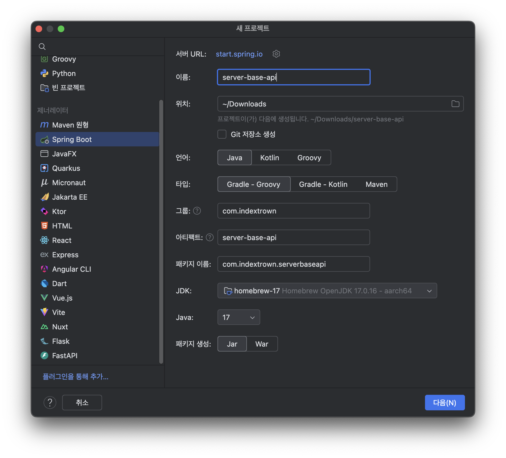
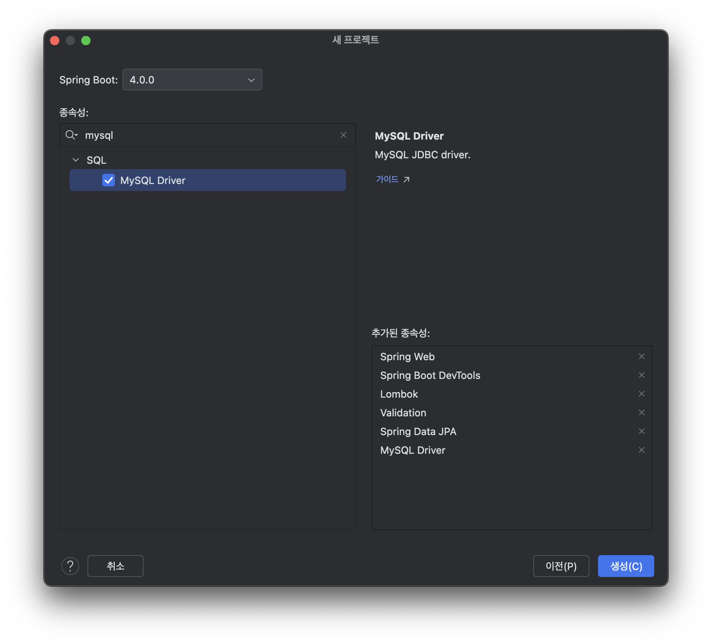
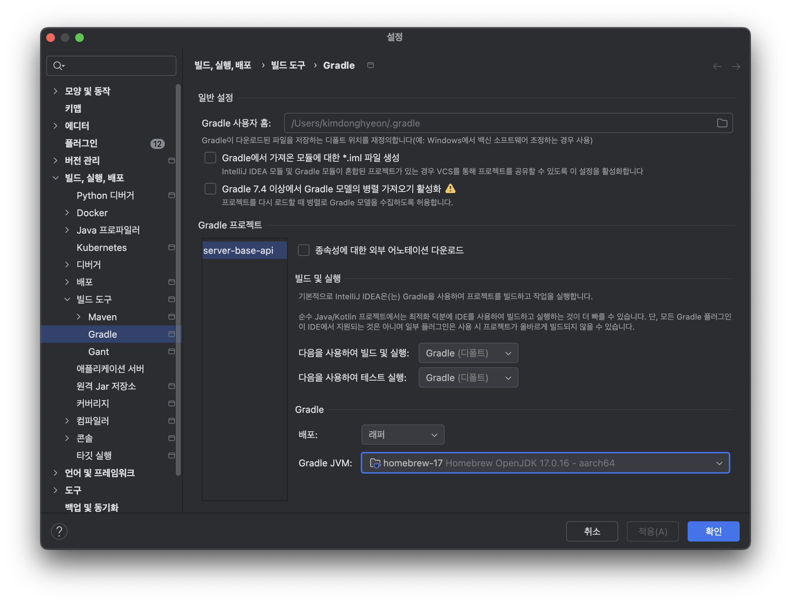

## 개요
엡 서버를 손쉽게 만들기 위한 Template 프로젝트를 만들며 정리한 글입니다.

## 프로젝트 세팅

- 이름과 경로를 지정하고 다음


- spring 버전을 4.x -> 3.x로 설정
- 각 의존성 선택후 프로젝트 생성 완료

## 오류 대처법

1. mysql 에러
    ```bash
    # 에러내용
    Failed to configure a DataSource: 'url' attribute is not specified
    Reason: Failed to determine a suitable driver class

    # 임시로 아래 코드로 해결 가능
    # application.yml
    spring:
    application:
        name: server-base-api

    autoconfigure:
        exclude:
        - org.springframework.boot.autoconfigure.jdbc.DataSourceAutoConfiguration
    ```
- 프로젝트 만들어진 후 실행버튼누르면 mysql연결이 되어 있지 않아 필연적으로 에러 발생

2. 실행 실패 에러

- java를 찾지 못할떄는 설정 -> 빌드/실행/배포 -> 빌드 도구 -> Gradle -> Gradle JVM을 직접 java17로 명시
- 프로젝트 정상 실행 확인

## 현재 사용중인 의존성(최신화중)
```java
# build.gradle
dependencies {
    // --- Spring ---
    implementation 'org.springframework.boot:spring-boot-starter-data-jpa'
    implementation 'org.springframework.boot:spring-boot-starter-validation'
    implementation 'org.springframework.boot:spring-boot-starter-web'
    developmentOnly 'org.springframework.boot:spring-boot-devtools'

    // --- DB ---
    runtimeOnly 'com.mysql:mysql-connector-j'

    // --- Lombok ---
    compileOnly 'org.projectlombok:lombok'
    annotationProcessor 'org.projectlombok:lombok'

    // --- Google ---
    implementation 'com.google.api-client:google-api-client:2.2.0'

    // Jackson2 JSON 팩토리 (반드시 필요)
    implementation 'com.google.http-client:google-http-client-jackson2:1.43.2'

    // --- Swagger ---
    implementation 'org.springdoc:springdoc-openapi-starter-webmvc-ui:2.7.0'

    // --- Unit Test ---
    testImplementation 'org.springframework.boot:spring-boot-starter-test'
    testRuntimeOnly 'org.junit.platform:junit-platform-launcher'
}
```

